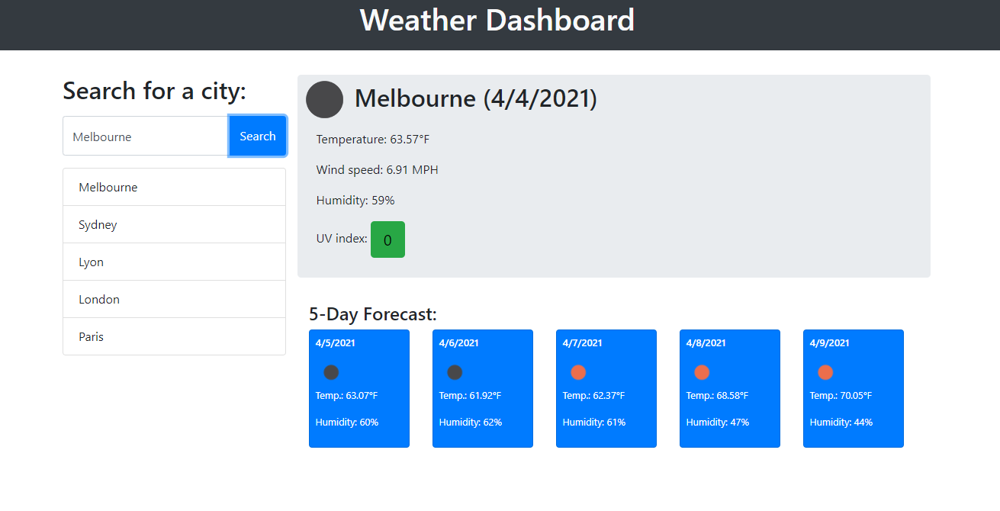

# Weather Dashboard
Homework due 2021-4-5



## Technologies Used
- HTML - Creates text and differents elements 
- CSS - styles html elements on page
- Bootstrap - CSS framework for styling
- Javascript - Backend coding
- jQuery - Javascript Framework
- moment.js - Time Framework
- openweathermap API - Provide the weather data
- Local Storage - Store the search history
- GitHub - hosts and deploys the pages
- Bash - Terminal

## Summary 
This Website allows you to get Weather infos about the city of your choice.
It gives you real time data as well as a 5 days forecast.
The last 5 cities you were looking for are added to the search history.

## Snippet 
```js
function searchCity() {
  var cityName = inputEl.val();
  getWeather(cityName);
  searchHistory.unshift(cityName);
  searchHistory = searchHistory.slice(0,5);
  localStorage.setItem("search",JSON.stringify(searchHistory));
  generateHistory();
}
```
This function that I created allowed me to store only the 5 most recent searches which prevents using too much space in Local Storage and make the data more readable.

## Deployed link
[Site](https://dylancouzon.github.io/Weather-Dashboard/)

## Author Links
[LinkedIn](https://www.linkedin.com/in/dcouzon/)
[GitHub](https://github.com/Dylancouzon)

