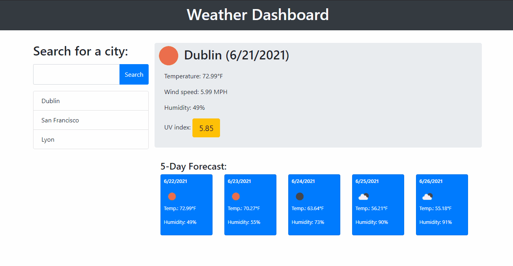

# Weather Dashboard
Project for UC Berkeley coding Bootcamp

[](https://opensource.org/licenses/MIT)



## Technology
 &nbsp;
 &nbsp;
 &nbsp;
 &nbsp;
 &nbsp;


- HTML
- CSS
- JavaScript
- Local Storage
- [Bootstrap](https://getbootstrap.com/)
- [jQuery](https://jquery.com/)
- [Moment.js](https://momentjs.com/)
- [openweathermap API](https://openweathermap.org/api)

<br>
<hr>

## Summary 
This App allows you to get Weather infos about the city of your choice.
It gives you real time data as well as a 5 days forecast.
The last 5 cities you were looking for are added to the search history.

<br>
<hr>

## Code 
```js
function searchCity() {
  var cityName = inputEl.val();
  getWeather(cityName);
  searchHistory.unshift(cityName);
  searchHistory = searchHistory.slice(0,5);
  localStorage.setItem("search",JSON.stringify(searchHistory));
  generateHistory();
}
```
This function that I created allowed me to store only the 5 most recent searches which prevents using too much space in Local Storage and make the data more readable.

<br>
<hr>

## Deployed Link

[See Live Site](https://dylancouzon.github.io/Weather-Dashboard/)

<br>
<hr>

## Author
- [dylancouzon@gmail.com](mailto:dylancouzon@gmail.com)
- [GitHub](https://github.com/Dylancouzon)
- [LinkedIn](https://www.linkedin.com/in/dcouzon/)
